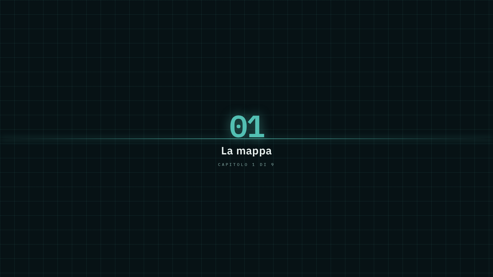
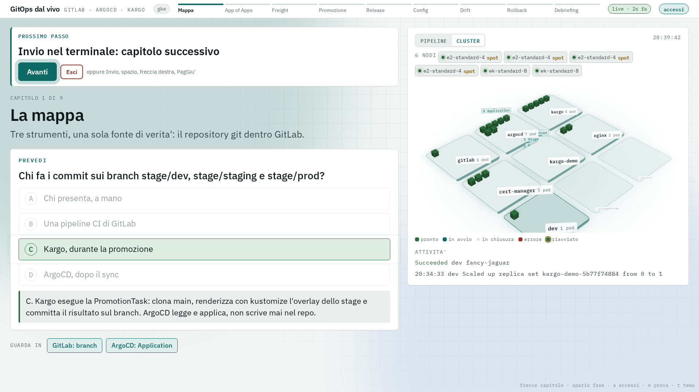
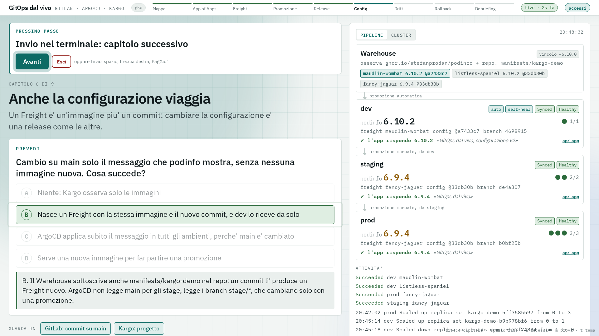

# GitOps dal vivo: GitLab, ArgoCD e Kargo su GKE

Una demo GitOps completa dentro un solo cluster Kubernetes. GitLab CE ospita il repository,
ArgoCD riallinea il cluster al repository, Kargo promuove le versioni tra dev, staging e prod
scrivendo commit. Tutto si crea e si smonta con uno script, su GKE Autopilot o su kind.

La demo è pensata per essere presentata: chi presenta guida il terminale, il pubblico guarda
un banco di regia nel browser che segue lo script da solo e fa votare una previsione prima di
ogni gesto.

## Presentare in tre comandi

```bash
./demo.sh prepare     # prima della sessione: cluster e piattaforma, circa 33 minuti su GKE
./demo.sh             # davanti al pubblico: nove capitoli, circa 35 minuti
./demo.sh teardown    # alla fine: smonta tutto, cluster compreso se lo confermi
```

Si presenta su un solo schermo condiviso: il banco di regia nel browser, con il terminale
accanto o dietro. Il banco si apre da solo e si comanda da lì:

- **Prossimo passo**: la barra in alto dice cosa succede adesso e cosa fare dopo. Il pulsante
  **Avanti** equivale a Invio nel terminale, e rispondono anche Invio, spazio, freccia destra e
  PagGiu' (va bene un telecomando da presentazione). Durante `prepare` la stessa barra mostra
  il passo in corso e i minuti.
- **Accessi** (pulsante in alto o tasto `a`): URL, utente e password di GitLab, ArgoCD e Kargo.
  Le password sono mascherate; un clic copia il valore negli appunti.
- **Pipeline / Cluster**: la colonna destra mostra i tre ambienti (versione, repliche, sync) oppure
  il cluster dal vivo, con nodi Autopilot, namespace e un quadratino per pod. Nella vista
  Cluster si vedono le repliche nascere e sparire durante drift e promozioni.
- A ogni cambio di capitolo parte una transizione a tutto schermo; tutte le animazioni si
  spengono con l'impostazione di sistema "riduci movimento".

Ogni capitolo segue lo stesso ritmo:

1. **Intro**: titolo e tre punti. Nel terminale, a chi presenta, cosa dire.
2. **Prevedi**: una domanda a scelta multipla, il pubblico vota per alzata di mano. La risposta
   giusta compare solo nel terminale.
3. **Azione e risposta**: lo script esegue il gesto mostrando ogni comando, poi il banco rivela
   la risposta con la spiegazione.

Nei capitoli di promozione compare anche **Tocca al pubblico** (o `u` nel terminale): lo script
aspetta che qualcuno promuova dalla UI di Kargo.

| # | Capitolo | Cosa succede | Min |
|---|----------|--------------|-----|
| 1 | La mappa | Chi scrive dove: main scritto dalle persone, i branch `stage/*` solo da Kargo | 3 |
| 2 | Il git comanda | Si cancella a mano una Application: la root `apps` la ricrea | 3 |
| 3 | Warehouse e Freight | Il Warehouse osserva podinfo `~6.9.0` e il repo: il Freight è tag più commit, dev si è promosso da solo | 4 |
| 4 | Promozione con cancello | prod rifiuta un Freight non passato da staging, poi staging e prod | 6 |
| 5 | Arriva una nuova versione | Un commit su main cambia il vincolo a `~6.10.0`: la 6.10 arriva solo in dev | 4 |
| 6 | Anche la configurazione viaggia | Un commit cambia solo il messaggio dell'app: nuovo Freight, stessa immagine | 4 |
| 7 | Drift: chi vince | Scale a mano: dev torna da solo, staging resta OutOfSync fino al Sync | 5 |
| 8 | Rollback | La versione nuova in staging, poi si ripromuove il Freight che c'era prima | 3 |
| 9 | Debriefing | Quattro domande finali, il limite dell'architettura e gli upgrade di piattaforma | 5 |



La vista Cluster in 3D durante il capitolo 1: un'isola per namespace, un cubo per pod, gli
oggetti Kargo e le Application sopra le isole.



Il capitolo 6: un commit che cambia solo il messaggio dell'app produce un Freight nuovo. dev lo
riceve e l'app risponde con il messaggio nuovo; staging e prod restano sul Freight precedente.



Il capitolo 7: staging scalato a mano resta OutOfSync, con le repliche in eccesso in arancione.


Nelle UI: la catena di Kargo dopo il rollback, i branch del repo con i commit di Kargo, le
Application generate dalla root.


Si riprende da un capitolo con `./demo.sh --from N`. `./demo.sh --list` elenca passi e capitoli.
Il banco si apre anche da file (`docs/banco-regia.html`) in modalità prova, con dati di
esempio: frecce per i capitoli, spazio per avanzare, `t` per il tema scuro.

Il server del banco ascolta solo su 127.0.0.1 e accetta i comandi solo con il token casuale
della sessione, dalla stessa origine: un'altra pagina aperta nel browser non può comandare la
demo.

## Architettura

```
                        cluster GKE Autopilot, tutto su nodi Spot
  +--------------------------------------------------------------------------+
  |  GitLab CE                  ArgoCD                     namespace          |
  |   root/platform   <-legge-  root app "apps"  -applica-> gitlab, argocd    |
  |     inventory/ gitlab/ argocd/                                            |
  |   root/nginx      <-legge-  Application nginx -------> nginx              |
  |   root/kargo-demo <-legge-  Application kargo-demo-* > kargo-demo-dev     |
  |     main: app/ kargo/                                    kargo-demo-staging |
  |     stage/dev staging prod  <-- commit -- Kargo          kargo-demo-prod  |
  |                                  Warehouse -> Freight -> Stage            |
  +----------------------------------------|---------------------------------+
                                  ghcr.io/stefanprodan/podinfo
```

Tre repository in GitLab, che nel repo locale sono le cartelle di `repos/`:

- `root/platform`: la root Application `apps` legge `inventory/`, dove c'è una Application per
  ogni componente e ogni app. La gestisce chi amministra il cluster.
- `root/kargo-demo`: l'app promossa da Kargo. `app/` contiene base e overlay kustomize, `kargo/`
  Project, Warehouse, PromotionTask e Stage. I branch `stage/*` stanno in questo repo: ogni app
  promossa ha i suoi, perché lo step `git-clear` della PromotionTask svuota l'intero branch.
- `root/nginx`: un'app senza promozione, sincronizzata da ArgoCD direttamente dal suo `main`.

ArgoCD usa un solo credential template (`repo-creds`) per il prefisso `root/`, quindi un repo
nuovo non richiede un secret nuovo.

- I branch `stage/*` contengono il manifest già renderizzato per quello stage. Li scrive la
  PromotionTask di Kargo (rendered manifests pattern): il diff di una promozione è esattamente
  ciò che ArgoCD applica.
- L'app è [podinfo](https://github.com/stefanprodan/podinfo): la sua pagina mostra versione e
  messaggio, e l'overlay di ogni stage le dà un colore diverso. Il banco chiede la versione
  all'app in esecuzione (`/version` via port-forward), non solo al manifest.
- Il Warehouse ha due sottoscrizioni, l'immagine e il repo (solo la cartella `app/`): ogni
  Freight è la coppia tag più commit, e la PromotionTask renderizza proprio quel commit.
- Tutti i pod della demo girano su nodi Spot: il `nodeSelector` sta nei manifest (GitLab, podinfo,
  nginx) e nei valori Helm di cert-manager; ArgoCD e Kargo, installati da manifest e chart
  upstream, vengono spostati con una patch. Su kind i nodi ricevono la stessa etichetta. Restano
  fuori solo i pod di sistema che GKE gestisce da sé (`kube-system`).
- dev ha auto-promozione (Kargo) e selfHeal (ArgoCD). staging e prod si promuovono a mano e non
  hanno sync automatico: il drift resta visibile come OutOfSync.

## Prerequisiti

GKE: `gcloud` autenticato, un progetto con billing, ruolo `container.admin` (o superiore) per
creare il cluster. Sul terminale: `kubectl`, `helm` >= 3.13, `jq`, `python3`, `curl`.
Per l'hash della password di Kargo serve uno fra `htpasswd`, `python3` con `bcrypt` o Docker
attivo; senza nessuno dei tre si usa l'hash precalcolato della password di default.

kind: Docker attivo, 8 GB di RAM liberi. `kind` e `kubectl` vengono installati se mancano.

Il control plane GKE è esposto solo via DNS endpoint (`--enable-dns-access`): l'accesso
dipende da IAM, non da una lista di IP autorizzati. Lo script non modifica la configurazione
gcloud attiva: ogni comando passa `--project`.

## Configurazione

Tutto sta in `lib/config.sh` e si sovrascrive con variabili d'ambiente.

| Variabile | Default | Nota |
|-----------|---------|------|
| `CLUSTER_PROVIDER` | `kind` per lo script di bootstrap, `gke` per `demo.sh` | oppure `--provider` |
| `GKE_PROJECT_ID` | `formazione-gerardo-cipriano` | |
| `GKE_CLUSTER_NAME` | `poc-gitops-1` | |
| `GKE_REGION` | `us-central1` | |
| `GKE_NETWORK`, `GKE_SUBNETWORK` | `injenia-test`, `injenia-gke-usc1` | la subnet deve avere i range secondari `pods` e `svc` |
| `GKE_PRIVATE_NODES` | `false` | con `true` serve un Cloud NAT per scaricare le immagini |
| `GITLAB_ROOT_PASSWORD` | valore demo | |
| `KARGO_ADMIN_PASSWORD` | valore demo | |
| `ARGOCD_VERSION` | `v3.5.3` | versione fissata |
| `KARGO_VERSION` | `1.9.2` | |
| `GITLAB_LOCAL_PORT`, `ARGOCD_LOCAL_PORT`, `KARGO_LOCAL_PORT`, `PALCO_LOCAL_PORT` | 8080, 8443, 8081, 8090 | se occupate si usa la successiva libera |
| `RELEASE_CONSTRAINT` | `~6.10.0` | vincolo usato nel capitolo 5 |

## Comandi di basso livello

`demo.sh prepare` chiama `bootstrap.sh`, che si usa anche da solo:

```bash
./bootstrap.sh --provider gke prereq|cluster|gitlab|gitops|argocd|kargo
./bootstrap.sh --provider gke status
./bootstrap.sh --provider gke portforward
./bootstrap.sh --provider gke delete-kargo|delete-argocd|delete-gitops|delete-gitlab
./bootstrap.sh --provider gke teardown        # guidato, una conferma per blocco
ASSUME_YES=1 DELETE_CLUSTER=1 ./bootstrap.sh --provider gke teardown
```

Per aggiungere un'applicazione senza promozione: crea `repos/<app>/` con i manifest (diventa il
repo `root/<app>`), copia `repos/platform/inventory/_template-application.yaml.tpl` in
`repos/platform/inventory/<app>-application.yaml`, rilancia `./bootstrap.sh gitops`. Per un'app
promossa da Kargo si parte invece da una copia di `repos/kargo-demo/`, con un Project Kargo
proprio.

## Sicurezza e limiti

Questa è una demo. Da dichiarare, prima che lo chieda qualcuno:

- Le password di GitLab e Kargo hanno valori di default nel repo. Si cambiano con le variabili
  d'ambiente; la password di ArgoCD e il token GitLab vengono generati a ogni installazione.
- GitLab gira senza TLS dentro il cluster, e Kargo è installato con
  `controller.allowCredentialsOverHTTP=true` per poterci scrivere.
- GitLab e il cluster che descrive coincidono: se cade il cluster cade la fonte di verità. In
  produzione il repository sta fuori.
- I servizi GitLab e Kargo sono NodePort (serve a kind). Su GKE con nodi pubblici non sono
  esposti solo perché la VPC non ha regole firewall in ingresso per quelle porte.
- ArgoCD e Kargo interrogano git e registry a intervalli (3 e 5 minuti): nella demo si chiede il
  refresh a mano, in produzione si usano i webhook.

## Troubleshooting

| Sintomo | Causa | Cosa fare |
|---------|-------|-----------|
| Le UI smettono di rispondere dopo qualche minuto | `kubectl port-forward` verso il DNS endpoint si blocca senza uscire | `demo.sh` sorveglia le porte e riavvia il forward da solo in 10-15 secondi |
| Application `OutOfSync` subito dopo una promozione riuscita | ArgoCD confronta con la HEAD del branch che ha in cache | `demo.sh` chiede un refresh; a mano: `kubectl annotate application <app> -n argocd argocd.argoproj.io/refresh=normal --overwrite` |
| Il self-heal di dev ci mette decine di secondi | Backoff esponenziale di ArgoCD sui self-heal ripetuti (2s, x3, max 300s) | Normale se il drift si ripete a breve distanza, per esempio durante le prove |
| GitLab riparte durante il primo avvio | Liveness probe prima della fine delle migrazioni | Risolto con una `startupProbe` da 20 minuti |
| Promozione rifiutata con `not available to Stage` | Il Freight non è ancora passato dallo stage a monte | È il comportamento mostrato nel capitolo 4 |

Il dettaglio dei concetti Kargo e della PromotionTask è in [docs/KARGO-DEMO.md](docs/KARGO-DEMO.md).

## Struttura

```
demo.sh                      presentazione: prepare, present, teardown
bootstrap.sh                 bootstrap per componente, usato da prepare
lib/
  config.sh common.sh        configurazione, log, port-forward
  cluster-gke.sh cluster-kind.sh prereq-gke.sh prereq-kind.sh
  gitlab.sh gitops.sh argocd.sh kargo.sh
  presenter.sh               banco di regia, collector live, API Kargo e GitLab
docs/
  banco-regia.html           pagina per il proiettore, servita da demo.sh
  KARGO-DEMO.md              concetti e passi della promozione
repos/                       un repo GitLab per cartella, pushati dal passo gitops
  platform/                  app-of-apps.yaml, inventory/, gitlab/, argocd/
  kargo-demo/                app/ (base e overlay), kargo/ (Project, Warehouse, Stage...)
  nginx/                     app di esempio senza promozione
scripts/screenshots.mjs      catture delle UI con Playwright
```
