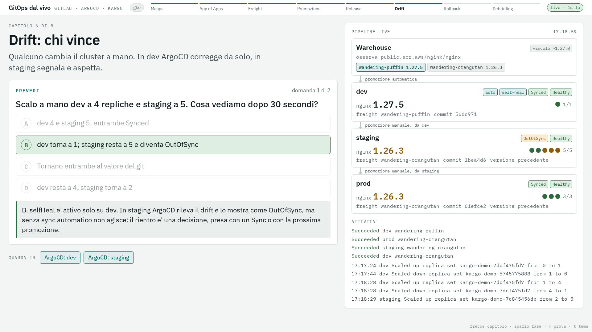
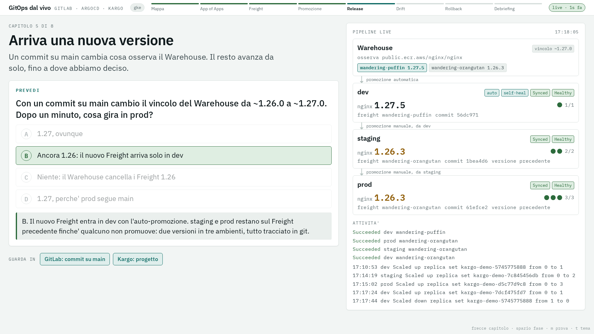
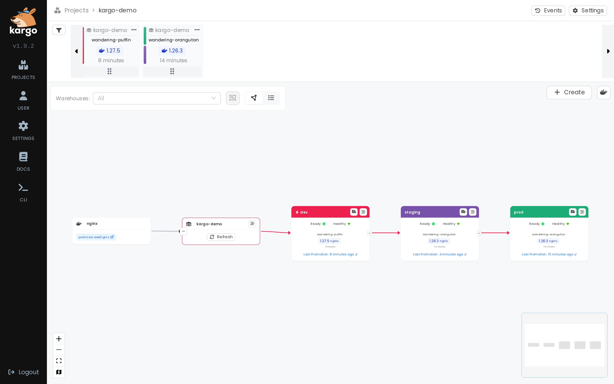
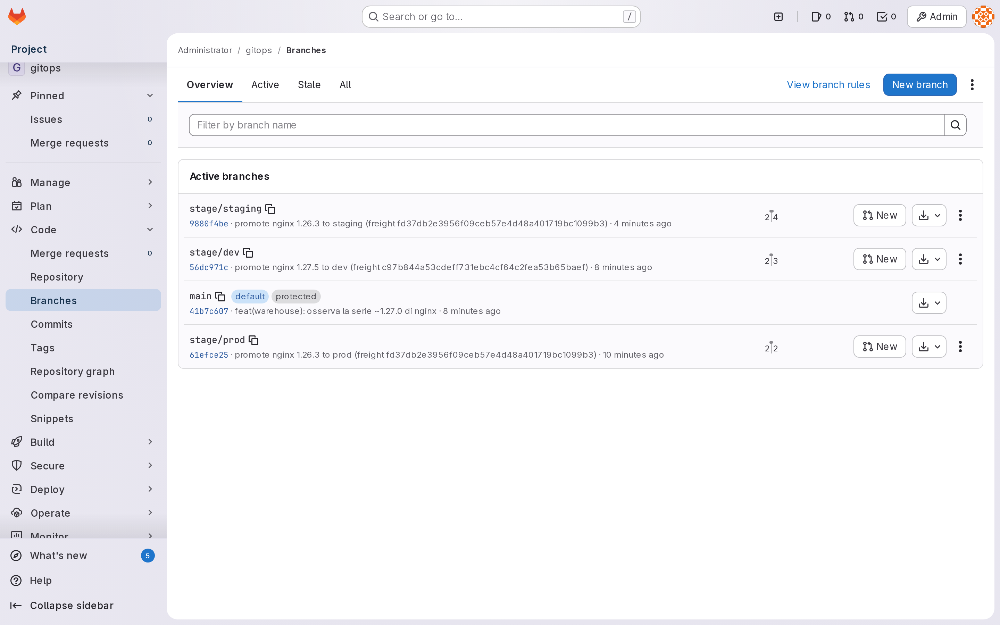

# GitOps dal vivo: GitLab, ArgoCD e Kargo su GKE

Una demo GitOps completa dentro un solo cluster Kubernetes. GitLab CE ospita il repository,
ArgoCD riallinea il cluster al repository, Kargo promuove le versioni tra dev, staging e prod
scrivendo commit. Tutto si crea e si smonta con uno script, su GKE Autopilot o su kind.

La demo e' pensata per essere presentata: chi presenta guida il terminale, il pubblico guarda
un banco di regia nel browser che segue lo script da solo e fa votare una previsione prima di
ogni gesto.

## Presentare in tre comandi

```bash
./demo.sh prepare     # prima della sessione: cluster e piattaforma, circa 30 minuti su GKE
./demo.sh             # davanti al pubblico: otto capitoli, circa 30 minuti
./demo.sh teardown    # alla fine: smonta tutto, cluster compreso se lo confermi
```

Disposizione consigliata: il banco di regia sul proiettore, il terminale sul proprio schermo.
All'avvio `demo.sh` apre i port-forward, stampa URL e credenziali delle tre UI e apre il banco
nel browser. Conviene fare login nelle tre UI prima del primo capitolo.

Ogni capitolo segue lo stesso ritmo, con tre Invio:

1. **Intro**: il banco mostra titolo e tre punti. Il terminale mostra cosa dire.
2. **Prevedi**: il banco pone una domanda a scelta multipla, il pubblico vota per alzata di mano.
   Il terminale mostra la risposta giusta solo a chi presenta.
3. **Azione e risposta**: lo script esegue il gesto mostrando ogni comando, poi il banco rivela
   la risposta con la spiegazione. Il pannello "Pipeline live" mostra versioni, repliche e stato
   di sync dei tre ambienti mentre cambiano.

Nei capitoli di promozione si puo' scrivere `u` invece di Invio: lo script aspetta che qualcuno
del pubblico promuova dalla UI di Kargo.

| # | Capitolo | Cosa succede | Min |
|---|----------|--------------|-----|
| 1 | La mappa | Chi scrive dove: main scritto dalle persone, i branch `stage/*` solo da Kargo | 3 |
| 2 | Il git comanda | Si cancella a mano una Application: la root `apps` la ricrea | 3 |
| 3 | Warehouse e Freight | Il Warehouse ha trovato nginx 1.26.x, dev si e' promosso da solo | 3 |
| 4 | Promozione con cancello | prod rifiuta un Freight non passato da staging, poi staging e prod | 6 |
| 5 | Arriva una nuova versione | Un commit su main cambia il vincolo a `~1.27.0`: la 1.27 arriva solo in dev | 4 |
| 6 | Drift: chi vince | Scale a mano: dev torna da solo, staging resta OutOfSync fino al Sync | 5 |
| 7 | Rollback | La 1.27 in staging, poi si ripromuove il Freight precedente | 3 |
| 8 | Debriefing | Tre domande finali e il limite dell'architettura | 4 |



Il capitolo 5 visto dal banco: la 1.27.5 e' arrivata solo in dev, staging e prod restano sulla
1.26.3 finche' qualcuno non promuove.



Nelle UI: la catena di Kargo dopo il rollback, i branch del repo con i commit di Kargo, le
Application generate dalla root.




Si riprende da un capitolo con `./demo.sh --from N`. `./demo.sh --list` elenca passi e capitoli.
Il banco si apre anche da solo (`docs/banco-regia.html`) in modalita' prova, con dati di
esempio: frecce per i capitoli, spazio per avanzare, `t` per il tema scuro.

## Architettura

```
                     cluster GKE Autopilot
  +-----------------------------------------------------------------+
  |                                                                 |
  |   GitLab CE  <---- legge ----  ArgoCD  ---- applica ---->  kargo-demo-dev
  |   root/gitops                  root app "apps"                  kargo-demo-staging
  |     main          <-- commit --  Kargo                          kargo-demo-prod
  |     stage/dev                    Warehouse -> Freight -> Stage
  |     stage/staging                     ^
  |     stage/prod                        | osserva i tag
  +---------------------------------------|-------------------------+
                                  public.ecr.aws/nginx/nginx
```

- `main` contiene i manifest sorgente: base e overlay kustomize, le Application in `inventory/`,
  le risorse Kargo in `manifests/kargo-project/`.
- I branch `stage/*` contengono il manifest gia' renderizzato per quello stage. Li scrive la
  PromotionTask di Kargo (rendered manifests pattern): il diff di una promozione e' esattamente
  cio' che ArgoCD applica.
- dev ha auto-promozione (Kargo) e selfHeal (ArgoCD). staging e prod si promuovono a mano e non
  hanno sync automatico: il drift resta visibile come OutOfSync.

## Prerequisiti

GKE: `gcloud` autenticato, un progetto con billing, ruolo `container.admin` (o superiore) per
creare il cluster. Sul terminale: `kubectl`, `helm` >= 3.13, `jq`, `python3`, `curl`.
Per l'hash della password di Kargo serve uno fra `htpasswd`, `python3` con `bcrypt` o Docker
attivo; senza nessuno dei tre si usa l'hash precalcolato della password di default.

kind: Docker attivo, 8 GB di RAM liberi. `kind` e `kubectl` vengono installati se mancano.

Il control plane GKE e' esposto solo via DNS endpoint (`--enable-dns-access`): l'accesso
dipende da IAM, non da una lista di IP autorizzati. Lo script non modifica la configurazione
gcloud attiva: ogni comando passa `--project`.

## Configurazione

Tutto sta in `lib/config.sh` e si sovrascrive con variabili d'ambiente.

| Variabile | Default | Nota |
|-----------|---------|------|
| `CLUSTER_PROVIDER` | `kind` per lo script di bootstrap, `gke` per `demo.sh` | oppure `--provider` |
| `GKE_PROJECT_ID` | `formazione-gerardo-cipriano` | |
| `GKE_CLUSTER_NAME` | `poc-gitops-1` | |
| `GKE_REGION` | `us-central1` | |
| `GKE_NETWORK`, `GKE_SUBNETWORK` | `injenia-test`, `injenia-gke-usc1` | la subnet deve avere i range secondari `pods` e `svc` |
| `GKE_PRIVATE_NODES` | `false` | con `true` serve un Cloud NAT per scaricare le immagini |
| `GITLAB_ROOT_PASSWORD` | valore demo | |
| `KARGO_ADMIN_PASSWORD` | valore demo | |
| `ARGOCD_VERSION` | `v3.5.3` | versione fissata |
| `KARGO_VERSION` | `1.9.2` | |
| `GITLAB_LOCAL_PORT`, `ARGOCD_LOCAL_PORT`, `KARGO_LOCAL_PORT`, `PALCO_LOCAL_PORT` | 8080, 8443, 8081, 8090 | se occupate si usa la successiva libera |
| `RELEASE_CONSTRAINT` | `~1.27.0` | vincolo usato nel capitolo 5 |

## Comandi di basso livello

`demo.sh prepare` chiama `deploy-k8s-bootstrap.sh`, che si usa anche da solo:

```bash
./deploy-k8s-bootstrap.sh --provider gke prereq|cluster|gitlab|gitops|argocd|kargo
./deploy-k8s-bootstrap.sh --provider gke status
./deploy-k8s-bootstrap.sh --provider gke portforward
./deploy-k8s-bootstrap.sh --provider gke delete-kargo|delete-argocd|delete-gitops|delete-gitlab
./deploy-k8s-bootstrap.sh --provider gke teardown        # guidato, una conferma per blocco
ASSUME_YES=1 DELETE_CLUSTER=1 ./deploy-k8s-bootstrap.sh --provider gke teardown
```

Per aggiungere un'applicazione: copia `manifests/gitops-inventory/inventory/_template-application.yaml.tpl`
in `inventory/<app>-application.yaml`, crea `manifests/<app>/`, rilancia il passo `gitops`.

## Sicurezza e limiti

Questa e' una demo. Da dichiarare, prima che lo chieda qualcuno:

- Le password di GitLab e Kargo hanno valori di default nel repo. Si cambiano con le variabili
  d'ambiente; la password di ArgoCD e il token GitLab vengono generati a ogni installazione.
- GitLab gira senza TLS dentro il cluster, e Kargo e' installato con
  `controller.allowCredentialsOverHTTP=true` per poterci scrivere.
- GitLab e il cluster che descrive coincidono: se cade il cluster cade la fonte di verita'. In
  produzione il repository sta fuori.
- I servizi GitLab e Kargo sono NodePort (serve a kind). Su GKE con nodi pubblici non sono
  esposti solo perche' la VPC non ha regole firewall in ingresso per quelle porte.
- ArgoCD e Kargo interrogano git e registry a intervalli (3 e 5 minuti): nella demo si chiede il
  refresh a mano, in produzione si usano i webhook.

## Troubleshooting

| Sintomo | Causa | Cosa fare |
|---------|-------|-----------|
| Le UI smettono di rispondere dopo qualche minuto | `kubectl port-forward` verso il DNS endpoint si blocca senza uscire | `demo.sh` sorveglia le porte e riavvia il forward da solo in 10-15 secondi |
| Application `OutOfSync` subito dopo una promozione riuscita | ArgoCD confronta con la HEAD del branch che ha in cache | `demo.sh` chiede un refresh; a mano: `kubectl annotate application <app> -n argocd argocd.argoproj.io/refresh=normal --overwrite` |
| Il self-heal di dev ci mette decine di secondi | Backoff esponenziale di ArgoCD sui self-heal ripetuti (2s, x3, max 300s) | Normale se il drift si ripete a breve distanza, per esempio durante le prove |
| GitLab riparte durante il primo avvio | Liveness probe prima della fine delle migrazioni | Risolto con una `startupProbe` da 20 minuti |
| Promozione rifiutata con `not available to Stage` | Il Freight non e' ancora passato dallo stage a monte | E' il comportamento mostrato nel capitolo 4 |

Il dettaglio dei concetti Kargo e della PromotionTask e' in [docs/KARGO-DEMO.md](docs/KARGO-DEMO.md).

## Struttura

```
demo.sh                      presentazione: prepare, present, teardown
deploy-k8s-bootstrap.sh      bootstrap per componente, usato da prepare
lib/
  config.sh common.sh        configurazione, log, port-forward
  cluster-gke.sh cluster-kind.sh prereq-gke.sh prereq-kind.sh
  gitlab.sh gitops.sh argocd.sh kargo.sh
  presenter.sh               banco di regia, collector live, API Kargo e GitLab
docs/
  banco-regia.html           pagina per il proiettore, servita da demo.sh
  KARGO-DEMO.md              concetti e passi della promozione
manifests/
  gitlab/ argocd/ nginx/     piattaforma e app di esempio
  kargo-project/             Project, ProjectConfig, Warehouse, PromotionTask, Stage
  kargo-demo/                base e overlay kustomize per stage
  gitops-inventory/          root Application e inventory delle Application
scripts/screenshots.mjs      catture delle UI con Playwright
```
